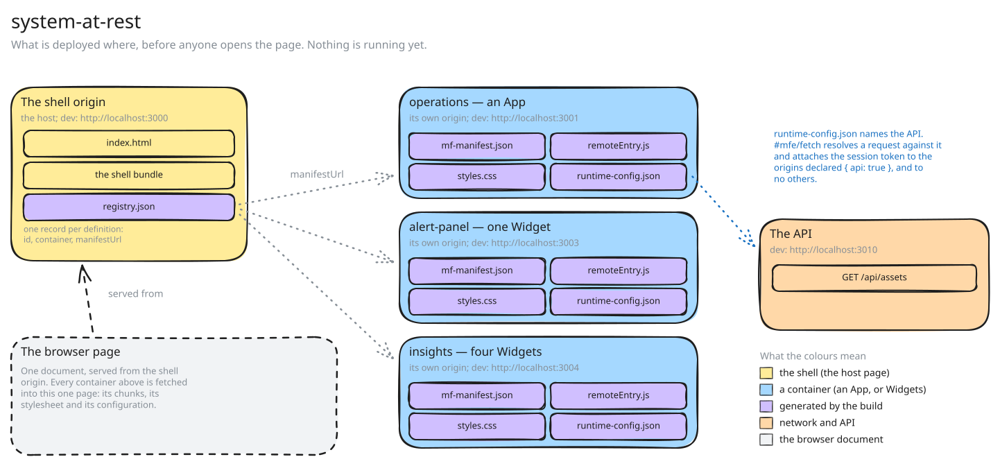
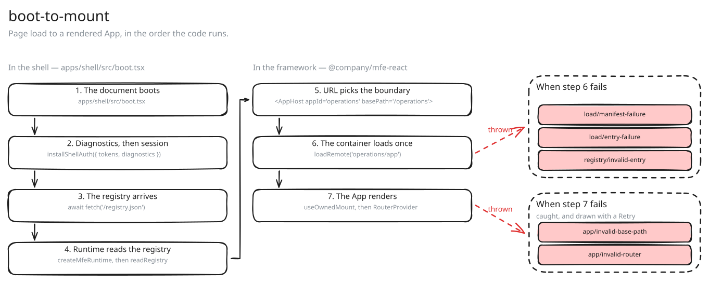
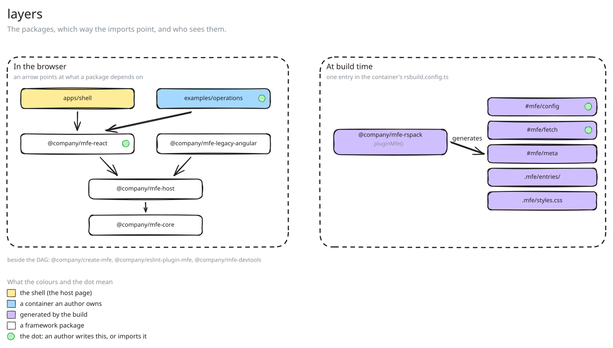
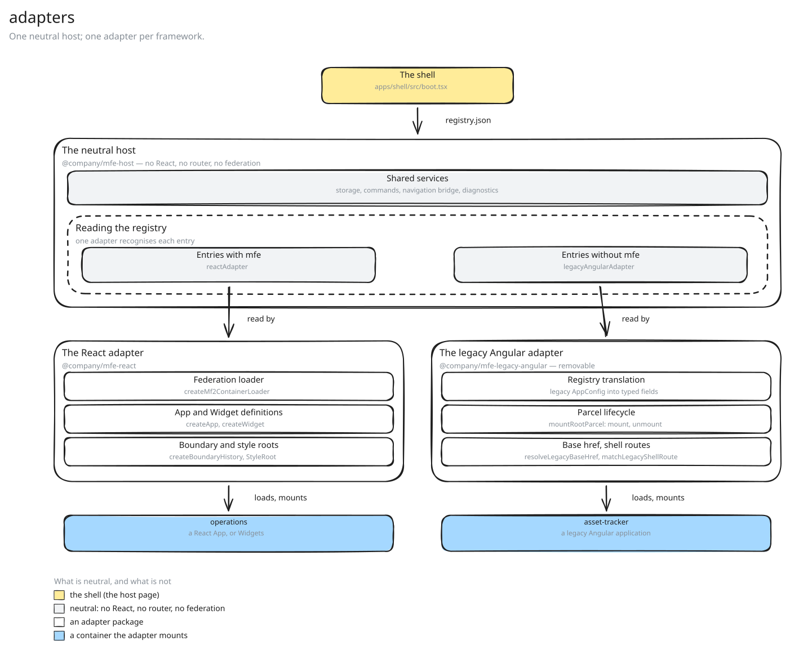
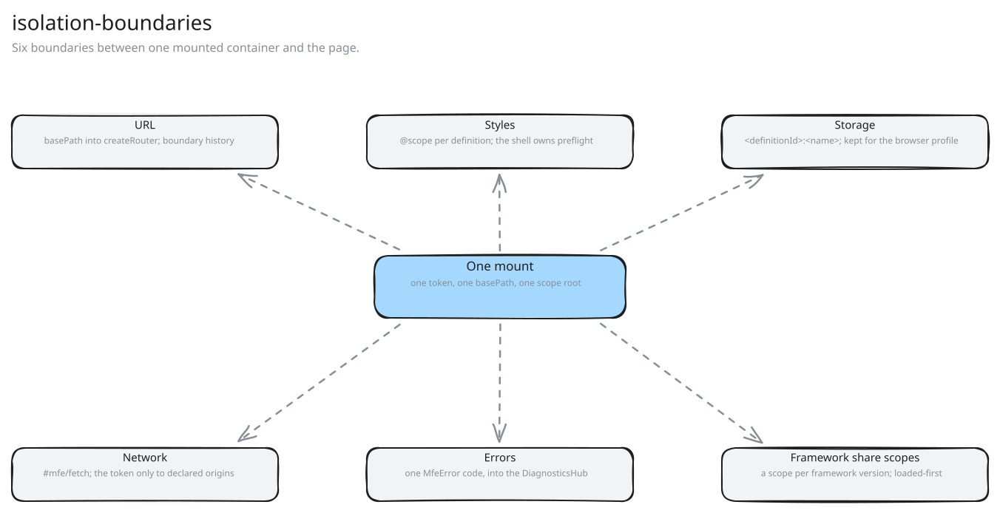

# Design map

This page is for reading away from the keyboard. It answers five questions, one per section.

- What is deployed, and where?
- What runs between a page load and a rendered App?
- Which package owns which concern?
- How do the two adapters fit together?
- What separates one mounted container from the rest of the page?

## What is deployed, and where

**In words.** Titled `system-at-rest`, under "What is deployed where, before anyone opens the page." Eleven boxes, read left to right.

- **The shell origin** (yellow, dev :3000) holds `index.html` and a violet `registry.json`, "one record per definition".
- An arrow **manifestUrl** reaches **Three container origins** (blue), holding `operations` (an App, :3001), `alert-panel` (one Widget, :3003) and `insights` (four Widgets, :3004).
- An arrow **publishes** reaches **Every container publishes**, holding `mf-manifest.json`, `remoteEntry.js`, `styles.css` and `runtime-config.json`.
- An arrow **names the API** drops from `runtime-config.json` to **The API** (orange, dev :3010), holding `GET /api/assets`.
- **The browser page** (grey) sits bottom left, "one document, from the shell origin". An arrow **served from** points up to the shell origin, and an arrow **fetched into** points from the published files down to it. A legend names the five colours.

A **micro-frontend** is one piece of a single web page, built, versioned and deployed on its own by its own team. There are no iframes: the page is one browser document with one React tree. One rule decides the shape of a piece. Apps take URLs, Widgets take props.

The **shell** is the application that serves that page. It owns the chrome, the theme, the session and the routes above a boundary, and it mounts Apps and Widgets into itself. It is the only application on the page with no registry entry.

The **registry** is the JSON array the shell fetches at boot, one entry per definition. An entry carries the id, the kind, the manifest URL, and the federation container and expose path. The rest is optional: a version, and either a Widget's published contract or an App's capabilities. Each entry is generated from the container's own build, because a hand-written second copy drifts.

A **container** is one deployable, with its own build, version and origin. It holds one `src/mfe.ts`, exporting at most one App and any number of Widgets. It publishes `remoteEntry.js`, the file that lets a host load code out of another build, described by `mf-manifest.json`. Its scoped stylesheet and its registry descriptor sit beside them.

`runtime-config.json` is published beside those assets, never built into them. Changing a value takes a new deployment and a reload. The generated `#mfe/fetch` resolves a relative URL against the first field declared `env(…, { api: true })`. The session token reaches those origins and no others, because the shell installs the page's one session ([decision 10](/docs/decisions#10-the-framework-owns-no-session-the-shell-installs-one-and-the-container-binds-to-it)).

| Party       | Owns                                                                                       |
| ----------- | ------------------------------------------------------------------------------------------ |
| the shell   | the document, the theme, the session, the registry fetch, the boundary routes, diagnostics |
| a container | its definitions, its route tree, the classes its CSS needs, its `runtime-config.json`      |
| the build   | the `#mfe/*` modules, the container entry, the federation options, the descriptor, the CSS |

## What happens between a page load and a rendered App

**In words.** Titled `boot-to-mount`, under "Page load to a rendered App, in the order the code runs." Twelve boxes: seven numbered steps in two columns, and five red error codes.

- Left column, "In the shell — `apps/shell/src/boot.tsx`": **1. The document boots**, **2. Diagnostics, then session** (`installShellAuth`), **3. The registry arrives** (`await fetch('/registry.json')`), **4. Runtime, then normalization** (`createMfeRuntime, then normalizeRegistry`).
- An arrow carries step 4 into the right column, "In the framework — `@company/mfe-react`".
- That column holds **5. URL picks the boundary** (`<AppHost appId='operations' basePath='/operations'>`), **6. The container loads once** (`loadRemote('operations/app')`) and **7. The App renders** (`useOwnedMount, then RouterProvider`).
- A red arrow **thrown** leaves step 6 for **When step 6 fails**: `load/manifest-failure`, `load/entry-failure`, `registry/invalid-descriptor`.
- A red arrow **thrown** leaves step 7 for **When step 7 fails** ("caught, and drawn with a Retry"): `app/invalid-base-path`, `app/invalid-router`.

Order carries weight at the start. The shell builds the diagnostics hub first, so `installShellAuth` has somewhere to report, and it installs the session before any remote is registered. It then fetches the registry and assembles the runtime, which adopts that hub rather than making one. A registry that fails to load is a diagnostic, not a crash.

Every entry is validated on its own, so one malformed entry loses only itself. A **boundary** is the stretch of URL assigned to one App mount. The shell can own `/$appId` for it because a definition id holds only lower-case letters, digits and single hyphens. A failure below that boundary leaves the chrome and every other App reachable.

A container loads once per runtime per id. **Module Federation** is the bundler mechanism that loads code from another build at run time. Its load promise is cached, a rejection included, because React needs the same settled promise to show the failure. There is no deadline: the load suspends until it settles or fails, and a retry is a person's click.

The **mount** is one live instance of a definition: its mount token, base path, telemetry, storage handles, abort signal, Query client and overlay root. The effect that creates it is the effect that destroys it. A mount built in a memo does not survive the remount React performs in StrictMode ([decision 14](/docs/decisions#14-a-mount-built-in-usememo-does-not-survive-a-remount-and-strictmode-remounts-everything)).

The **definition** is a side-effect-free descriptor. The adapter therefore checks what the author did with it: `basePath` passed through as `basepath`, the supplied history by identity, `context.mfe` and `context.queryClient` unchanged. A violation throws during render and names the repair. On any failure the consumer's `fallback` receives the error and a `retry` that forgets the cached definition.

## The packages, and which way the imports point

**In words.** Titled `layers`, under "The packages, which way the imports point, and who sees them." Twelve boxes in two regions.

- **In the browser** ("an arrow points at what a package depends on"): `apps/shell` and `examples/operations` both point at `@company/mfe-react`. `@company/mfe-react` and `@company/mfe-legacy-angular` both point at `@company/mfe-host`, which points at `@company/mfe-core`.
- A line under the graph names what sits beside it: `@company/create-mfe`, `@company/eslint-plugin-mfe`, `@company/mfe-devtools`.
- **At build time** ("one entry in the container's `rsbuild.config.ts`"): `@company/mfe-rspack` (`pluginMfe()`), with one arrow **generates** into `#mfe/config`, `#mfe/fetch`, `#mfe/meta`, `.mfe/entries/` and `.mfe/styles.css`.
- A green dot marks `examples/operations`, `@company/mfe-react`, `#mfe/config` and `#mfe/fetch`. The legend names the four colours and the dot.

An arrow in the picture points at what a package depends on. `pnpm boundaries` reads the `src/**` imports and each manifest alike, so a forbidden edge cannot be added by editing a `package.json`.

| Package                       | What it owns                                                  | Depends on            | Never imports                                 |
| ----------------------------- | ------------------------------------------------------------- | --------------------- | --------------------------------------------- |
| `@company/mfe-core`           | Identity, errors, Widget contracts, telemetry types, records. | nothing               | React, a router, single-spa, federation       |
| `@company/mfe-host`           | Registry, adapter selection, shell state, storage, commands.  | core                  | React, a router, single-spa, federation       |
| `@company/mfe-react`          | The author API, the router adapter, the loader.               | core, host            | single-spa, a vendor SDK, the developer tools |
| `@company/mfe-legacy-angular` | The removable legacy adapter.                                 | core, host            | React, a router, the React adapter            |
| `@company/mfe-rspack`         | `pluginMfe()`: the generated modules, entries, stylesheet.    | core                  | —                                             |
| `@company/mfe-devtools`       | The developer tools overlay, gated on one key.                | core, host, React     | single-spa, a vendor SDK, the build plugin    |
| `@company/create-mfe`         | The scaffold, `pnpm create @company/mfe <directory>`.         | nothing               | —                                             |
| `@company/eslint-plugin-mfe`  | The `framework` and `author` lint presets.                    | nothing               | —                                             |
| `apps/shell`                  | The host page: the chrome, the boundary routes, the session.  | React, host, devtools | —                                             |

The build plugin runs in the build rather than on the page, so it sits outside that graph. One `pluginMfe()` line in a container's `rsbuild.config.ts` generates the `#mfe/*` modules, the container and App entries, the registry descriptor and the scoped stylesheet.

An author touches `src/mfe.ts`, the route tree under `src/routes/`, `src/mfe.config.ts`, the generated modules and that one plugin line. Authors import from `@company/mfe-react` and nowhere else. The `author` lint preset blocks the core, the host and any deep path.

The design rule is one sentence: every micro-frontend concern uses a mechanism TanStack Router already has, or it stays invisible. Module Federation stays invisible, in one framework file and one shell file ([decision 6](/docs/decisions#6-federation-lives-in-the-react-adapter-not-in-the-neutral-host)). So do the registry JSON, everything under `.mfe/`, the mount token, the scope root, the overlay root and the diagnostics wiring.

## How the adapters fit together

**In words.** Titled `adapters`, under "One neutral host; one adapter per framework." Twelve boxes, read top to bottom.

- **The shell** (`apps/shell/src/boot.tsx`) sits at the top, with an arrow **registry.json** into **The neutral host** ("@company/mfe-host — no React, no router, no federation").
- The host holds **Shared services** ("storage, commands, navigation bridge, diagnostics") and, under it, **Registry normalization** ("the first matching rule owns the entry").
- Inside that, **Rule 1 — framework contract** (`createMfeContractRule()`) and **Rule 2 — legacy Angular** (`createLegacyAdapterRule()`), joined by an arrow **no mfe key**.
- An arrow **selects** drops from each rule to its adapter. **The React adapter** holds **Federation loader** (`createMf2ContainerLoader`), **App and Widget definitions** (`createApp, createWidget`) and **Boundary and style roots** (`createBoundaryHistory, StyleRoot`). **The legacy Angular adapter** ("removable") holds **Registry translation**, **Parcel lifecycle** (`mountRootParcel`) and **Base href, shell routes** (`resolveLegacyBaseHref, matchLegacyShellRoute`).
- An arrow **loads, mounts** drops from each adapter to its blue container, `operations` and `asset-tracker`. The legend names the shell, a neutral package, an adapter package and a container.

The host is neutral: `@company/mfe-core` and `@company/mfe-host` import no React, no router and no Module Federation. The host defines a `ContainerLoader` port and orchestrates loading through it, and an adapter supplies the implementation. Normalizing the registry is one pass, and each raw entry goes to the first adapter rule that takes it. The framework contract rule runs first, and the rules a shell passes in `createMfeRuntime({ rules })` run after it, in order.

| Adapter                       | Takes an entry when                                      | Mounts it with           | Removable |
| ----------------------------- | -------------------------------------------------------- | ------------------------ | --------- |
| `@company/mfe-react`          | the entry declares the framework contract (an `mfe` key) | React, Module Federation | no        |
| `@company/mfe-legacy-angular` | there is no `mfe` key, plus a `name` and `mfManifestUrl` | a single-spa parcel      | yes       |

The React adapter loads a container through Module Federation. It then mounts the `createApp` and `createWidget` definitions that container exposes. The legacy adapter translates a legacy entry into the same neutral record, keeping every legacy field in `adapterData`. It drives the application's own parcel lifecycle, resolves the base href that application expects, and leaves a fixed set of routes to the shell.

Nothing falls back silently. An entry that declares the framework contract belongs to the React adapter, whatever state that declaration is in. A malformed declaration is set aside with a reason, and the registry marks it `quarantined`. Reading it as legacy instead would let a typo change how an application loads, unseen.

Shared services come from the host and are the same for both. One storage store, one command registry, one breadcrumb store, one navigation bridge and one diagnostics hub are built per runtime. A shell screen reads the normalized registry and never asks which adapter an entry came from.

Removal is the point of the second adapter. When the last legacy application is migrated, delete the package, one row from the shell's adapter table and one import from its composition root. No other package changes. [Legacy Angular applications](/docs/reference/legacy-angular) is the reference for its fields, its lifecycle and its migration edit.

The adapter is built and tested against production-equivalent fixtures and doubles. The real Asset Tracker and Rigstream applications have never been run against it ([decision 9](/docs/decisions#9-legacy-angular-compatibility-is-proven-against-fixtures-not-the-real-applications)). The shell in this repository does not register this adapter yet, so it registers the framework contract rule alone. A legacy entry in its registry is set aside as `registry/invalid-descriptor`.

## The six isolation boundaries

**In words.** Titled `isolation-boundaries`, under "Six boundaries between one mounted container and the page." Seven boxes.

**One mount** ("one token, one basePath, one scope root") sits in the middle. One dashed arrow points out to each of the six boxes around it.

- **URL** — "basePath into createRouter; boundary history".
- **Styles** — "@scope per definition; the shell owns preflight".
- **Storage** — "`<definitionId>:<name>`; retention decides who reads".
- **Network** — "#mfe/fetch; the token only to declared origins".
- **Errors** — "one MfeError code, into the DiagnosticsHub".
- **Shared singletons** — "one copy per page; shareStrategy loaded-first".

### URL

The **base path** is the literal string form of the boundary. After `createRouter({ basepath })` it never appears again: every route, `Link` and `navigate` is relative to it. The **boundary history** is hand-built, because `createBrowserHistory()` reassigns `window.history.pushState` for the whole page ([decision 1](/docs/decisions#1-the-boundary-history-is-built-by-hand-because-createbrowserhistory-patches-globals)).

### Styles

The `@scope` rule buys scope proximity in place of injection order, so two builds that both spell `bg-primary` no longer resolve by parse order. Each mount renders a **scope root** carrying `data-mfe-scope`, with a build-attached **style root** inside it. Overlays portal into a body-level **overlay root** carrying the same attribute. `@scope` is the narrowest-supported feature the framework requires, at Chrome 118, Firefox 146 and iOS Safari 17.4, with no fallback ([decision 17](/docs/decisions#17-each-container-ships-its-own-stylesheet-scoped-to-its-own-mount-roots)).

### Storage

The key is never scoped by mount token, so two mounts of one definition read the same record. **Retention** says who may read a value back, rather than how long it lives: `'browser'` is the default and is never cleared, where `'user'` is cleared when the session generation changes. `@host` is spelled with an `@` because no definition id can contain one, which is what makes the scope unclaimable ([decision 24](/docs/decisions#24-the-host-page-had-no-storage-scope-and-the-lint-allowlist-was-the-evidence)).

### Network

`#mfe/fetch` is a standard `fetch` bound to one container's **transport**, so a route loader passes its own `signal`. It retries once after a 401 when the request can be replayed, and a 403 passes through untouched, because attaching a token is not authorization. The allowlist has no wildcards: a wildcard would hand the session token to any host the pattern happens to match.

### Errors and diagnostics

The message is composed to a fixed shape: `<id>[@<version>] failed to <operation>[ <path>][: expected …, received ….] <repair>`. The `code` comes from a closed union, so adding one is a deliberate contract change. A sink that throws cannot stop the others, and a hub with no sinks discards everything.

### Shared singletons

Eight specifiers are shared with `strictVersion`: `react`, `react-dom`, `sonner`, the three `@company/mfe-*` packages, `@tanstack/react-router` and `@tanstack/react-query`. A second copy makes every hook fail with "rendered outside any mount", while both copies look correct on their own. A container may add to that list and cannot remove from it ([decision 30](/docs/decisions#30-a-host-resolves-shares-against-the-scope-it-has-not-against-every-remote-it-knows)).

## Where to read next

- [The shape: App or Widget](/docs/guides/shape) — the first decision, and the ten guides in order.
- [Legacy Angular applications](/docs/reference/legacy-angular) — the second adapter, field by field.
- [Glossary](/docs/glossary) — every term on this page, defined once.
- [Decision log](/docs/decisions) — the argument behind each rule stated here.
